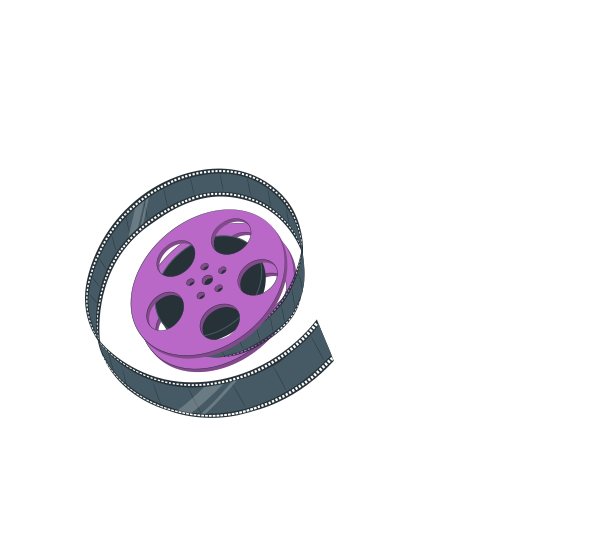
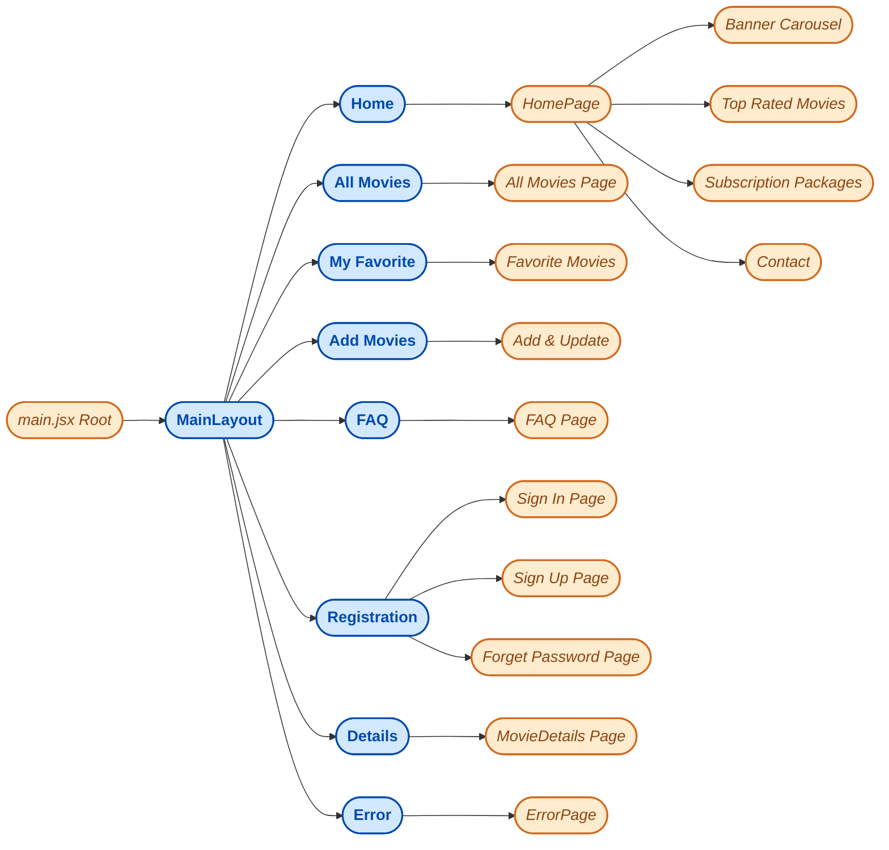
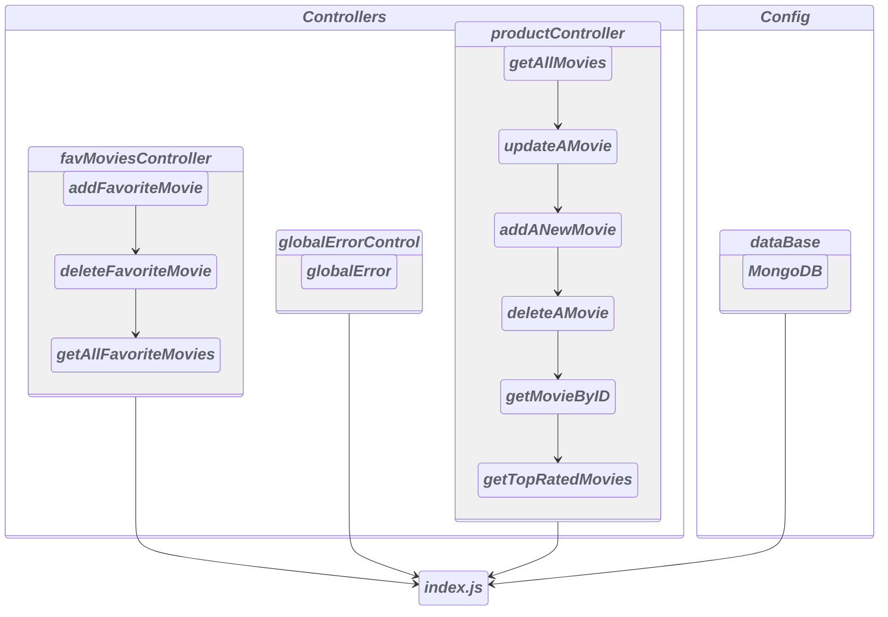
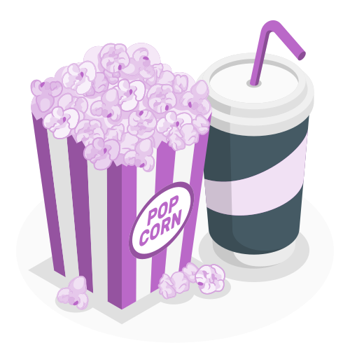

<a>
<h1 align="center">ReelEra</h1>

one stop for All movies

</a>

***

#### *Intro*

*Basically it's an online portal for movie lovers, movie freak can upload movies of their personal interest. Our goal is to make it an open source for them who love to add movies in their watchList and can get the updates about new upcoming movies and can buy tickets online...*
#### *Key Features*
*Its an open source for all kind of people who love to watch and share their zone of interest with others, all they need to do just login or Sign up*
- *On first landing page their is a carousel of new released and upcoming movie posters, then our top rated movies based on our users ratings. A subscription package section for our premium users who will like to get every single updates about new movies.Our contact details and a social section where user can join our Gang in social sites*
*On add Movie page user can add movies what ever he likes most cause we do believe in sharing so it's open for all to contribute*
- *All movies section is a free zone where any user can visit. without login he won't be able to go further long*
- *Registration process of ours is so simple, All you need to do create an user on signUp page and you are good to go. If you don't like to be bother by login process then google signUp would be the best. Existed user can login and can set password if they fail to login with existed credentials **(Note:password should be 8characters long and must have a special character, one uppercase and lowercase letters)***
- *Only logged in user can add Movies on add movies section he/she need to go through our general criteria, No reel or short movies are allowed*
- *Details page with come up with details of selected movie, where user can edit or delete movies or can save them as their Favorite one*
- *If user think these information of details page is not proper so he can update the details as well by clicking on pen icons will give him the access of detail page*
- *User can't choose one movies again n again it well turn red whenever they add that particular movie on their favorite list*
- *On My Favorite page user can have a look of his favlisted movies, as well as can delete their already watched movies by clicking on remove button*
- *We got an FAQ section for those users who like to know more about us and to serve their little queries without spending a single word*

##### *Web Dev Zone*
This simple single page website was created with-
- TailwindCss
  - custom Classes.
  - Applied utility class.
  - InlineCss.
  
- Framer Motion
  - Basic Enter Animation.
  - Gestures.
  - Variants.
  - useScroll Hook.
  - useTransform Hook.
  - useSpring Hook.
  - WhileInView
  
- Javascript
   - Basic JS like ternary, Double Not, OR operator, Array Methods,Async Functions,Regular Functions, Immediately Invoked Function Expression, Optional Chaining, TryCatch blocks, fetching method and more...
- React Vite
    - useState with conditional values
    - useEffect, with no dependencies, multiple Dependencies..
    - Custom Hook,
    - Context API..
- React Router Dom
  - Optional Routing,
  - Dynamic Routing,
  - Index routing,
  - useRouterError,
  - Navigate Component,
  - Outlet,  
  - useParams,
  - useLoaderData,
  - useNavigate,
  - useLocation,
  - Link
  - NavLink
- Express js
  - POST
  - GET
  - PUT
  - DELETE methods
- Node js & MongoDB.
  - insertOne()
  - find()
  - findOne()
  - DeleteOne()
  - updateOne() 

    <a>
    <h4 align="center">Route & Components</h4>
    
<i>Simple overview of routes & Components are distributed following this Diagram</i>

    </a>

***

    <a>
    <h4 align="center">Server</h4>
    
Simple File & Folder map

    </a>

***

##### *Errors and Challenges*
- *As criteria I took challenge to apply react-hook-form for all input fields except search bar. Here I learn few new functionalities like how to handle error, crating setError manually, register input fields and handling errors with formState:{errors}, clear manual Errors, reset input fields, watch specific field changes like state, control and Controller concepts are not really clear yet...*
- *React-simple-Rating was not so simple to handle with react hook form*
- *As add and Edit are the quite similar functionality same form for both Add and Edit operations based on conditions and mode*
- *Tried to apply add to favorite button toggler which one through me into an infinity loop*
- *Search functionality was awesome thanks to Shariyar Vai for better explanation, few things are clear but still now need to learn more about MongoDB and Node.js*
- *Thanks to Dave Gray, procademy, piyushGarg, codeWithRobby for a global error handler, cause it was really great and effective way to handle error rather then watching red texts on terminals.Know this was not an standard way to handle it I just tried to apply just a portion of their huge project, still learning and getting confused but improving myself*
- *Tried to apply framer motion animation here though I'am in learning process but I found it quite easier then GSAP animation*
- *Tried to explain my whole project into mermaid charts I found it really great to explain and to debug codes* 

***
[_Feel Free to Visit **ReelEra**_](https://reeleraassignment10.netlify.app/)

 
 
 
 
 
 
 
 
 

### *Thanks for Visiting*
### <a>*ReelEra*</a>

***Everyone knows that debugging is twice as hard as writing a program in the first place. So if you're as clever as you can be when you write it, how will you ever debug it?***

<a> ― *Brian Kernighan*</a> 
